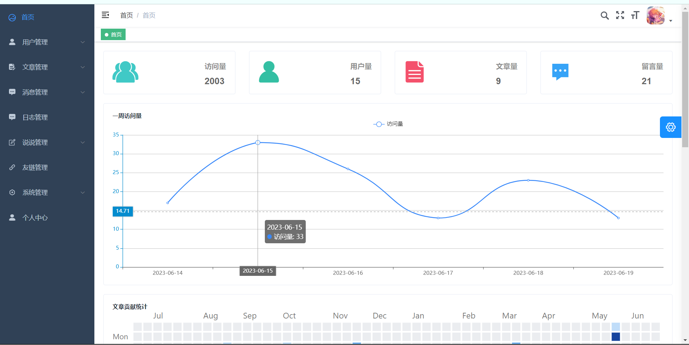

## 博客介绍

  

   基于Springboot + Vue2 开发的前后端分离博客

   <a target="_blank" href="https://github.com/X1192176811/blog">
      
      
      
      
      
      
      
      
      
      
      
   </a>

[在线地址](http://www.mingzib.xyz/)

## 技术栈

前端：vue2 + vuex + vue-router + axios + vuetify + element + echarts

后端：SpringBoot + SpringSecurity + MybatisPlus + MySQL + nginx + docker + Swagger2 + Redis \+ RabbitMQ + Websocket + Maxwell + ElasticSearch + Jsoup 

## 项目特点

- 前台参考"Hexo"的"Butterfly"主题设计，美观简洁，响应式体验好。
- 后台使用element-admin实现，功能强大
- 发布博客使用采用Markdown编辑器，写法简单。
- 评论支持表情输入回复等，emoji使用的是抖音表情。
- 前后端分离部署，降低维护成本。
- 接入第三方登录，减少注册成本。
- 支持发布说说，随时分享趣事。
- 留言采用弹幕墙，更加炫酷。
- 支持代码高亮和复制，图片预览，深色模式等功能，提升用户体验。
- 搜索数据支持高亮分词，响应速度快。
- 新增文章目录、推荐文章等功能，优化用户体验。
- 新增在线聊天室，支持撤回、统计未读数量等功能。
- 新增aop注解实现日志管理。  
- 后台管理支持修改博客背景图片，博客配置等信息，操作简单。
- 网站全局搜索，智能搜索想要的数据
- 爬取网络图片，博客内直接爬取想要的博客封面
- 代码支持多种搜索模式（Elasticsearch或MYSQL），支持多种上传模式（七牛云或本地），可快速扩展
- 内置chatGPT，实现自己的人工智能
- 代码遵循阿里巴巴开发规范，利于初学者学习。

##  运行截图
**前台界面**

chatGPT流式对话

文章详细信息

说说页面

**后台界面**

## 在线体验
前台地址：http://www.mingzib.xyz/

后台地址：http://www.admin.mingzib.xyz/

测试账号：test

测试密码：123456

## docker快速搭建

详见文章[ 博客部署教程 ](http://www.mingzib.xyz/articles/21)